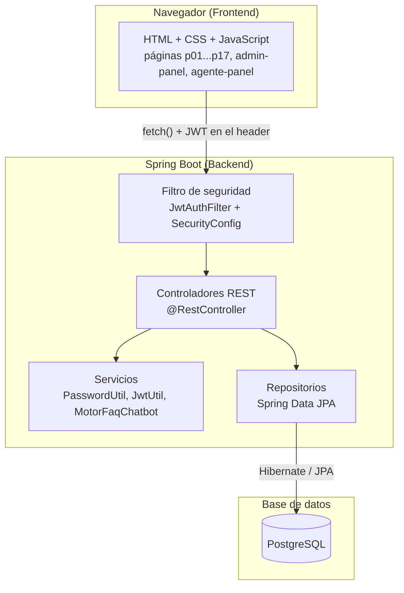
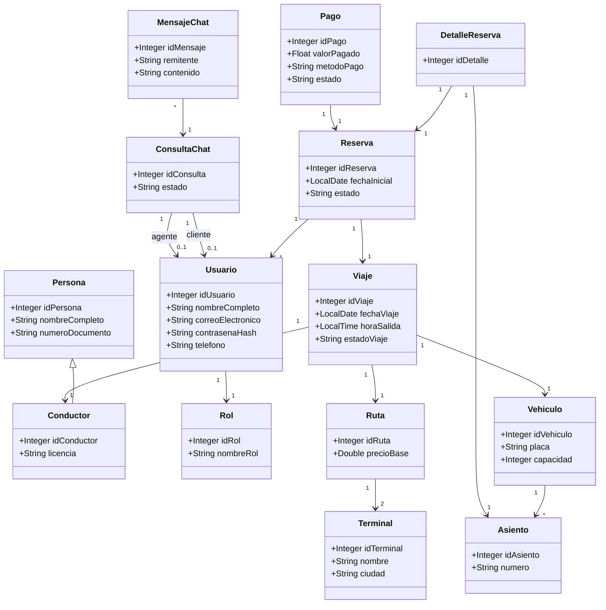

# 2. Diseño del Sistema — Proyecto Concorde

## 2.1 Arquitectura general

El proyecto sigue una arquitectura de 3 capas clásica, todo servido
desde una sola aplicación Spring Boot (el propio backend sirve los
archivos estáticos del frontend):

**Por qué esta arquitectura:** separar controlador → servicio →
repositorio permite que cada capa tenga una sola responsabilidad
(recibir la petición HTTP, aplicar lógica de negocio, hablar con la
base de datos), lo que hace el código más fácil de mantener y de
probar por separado (ver `04-plan-de-pruebas.md`, donde los servicios
se prueban sin necesitar la base de datos).

## 2.2 Diagrama de clases (modelo de dominio)

## 2.3 Interfaces (pantallas) del sistema

El listado completo con la descripción de cada pantalla está en
`DOCUMENTACION.md` (sección 9). En resumen, se agrupan en tres bloques:

1. **Público / cliente** (17 páginas: `index.html` a `p17-...html`):
   búsqueda, registro, login, flujo de compra, mis reservas, perfil,
   atención al cliente.
2. **Panel de agente** (`agente-panel.html`): chat, reservas, usuarios,
   pagos, viajes.
3. **Panel de administrador** (`admin-panel.html`): todo lo del agente
   + catálogo completo, reportes, configuración.

## 2.5 Casos de uso oficiales vs. lo implementado

El diagrama de casos de uso del equipo (`docs/originales-equipo/casos_de_uso.pdf`,
"Sistema de innovación y mejoramiento de atención al cliente — SIMAC")
define estos actores: **Cliente/Pasajero**, **Administrador**,
**Conductor** y **Visitante**. Comparado con lo que el sistema
realmente tiene implementado, hay dos diferencias que vale la pena
explicar en la sustentación (mejor decirlas con conocimiento de causa
que que las encuentre el jurado):

- **Rol AGENTE**: no aparece en el diagrama de casos de uso original,
  pero sí está implementado (`agente-panel.html`). Se agregó después,
  cuando se sumó el chatbot de atención al cliente, para que alguien
  pudiera atender las conversaciones escaladas por el bot sin darle
  todos los permisos de administrador. Es una ampliación del alcance
  original, no una desviación accidental.
- **Rol CONDUCTOR como actor con sesión propia**: el diagrama original
  le da al conductor casos de uso propios ("Consultar viajes
  asignados", "Consultar vehículo asignado", "Consultar ruta
  asignada"), lo que implica que un conductor debería poder iniciar
  sesión. **Esto no está implementado**: en el sistema actual,
  `Conductor` es solo un dato que administra el administrador/agente
  (parte del catálogo), no un usuario que inicia sesión. Es una
  funcionalidad pendiente si se quiere cumplir el 100% del diseño
  original.

## 2.6 Decisiones de diseño relevantes

- **JWT en vez de sesiones de servidor:** permite que el backend no
  tenga que recordar quién está logueado (stateless), lo cual escala
  mejor y es el estándar actual para APIs REST.
- **Chatbot por palabras clave en vez de un modelo de IA externo:** es
  suficiente para preguntas frecuentes, no depende de un servicio de
  pago externo, y su comportamiento es 100% predecible y explicable
  en la sustentación.
- **Reportes calculados en memoria (streams de Java) en vez de SQL
  complejo:** más fácil de leer y de explicar línea por línea frente a
  un jurado, al costo de ser menos eficiente con volúmenes grandes de
  datos (ver la nota de complejidad en `DOCUMENTACION.md`, sección 8).
