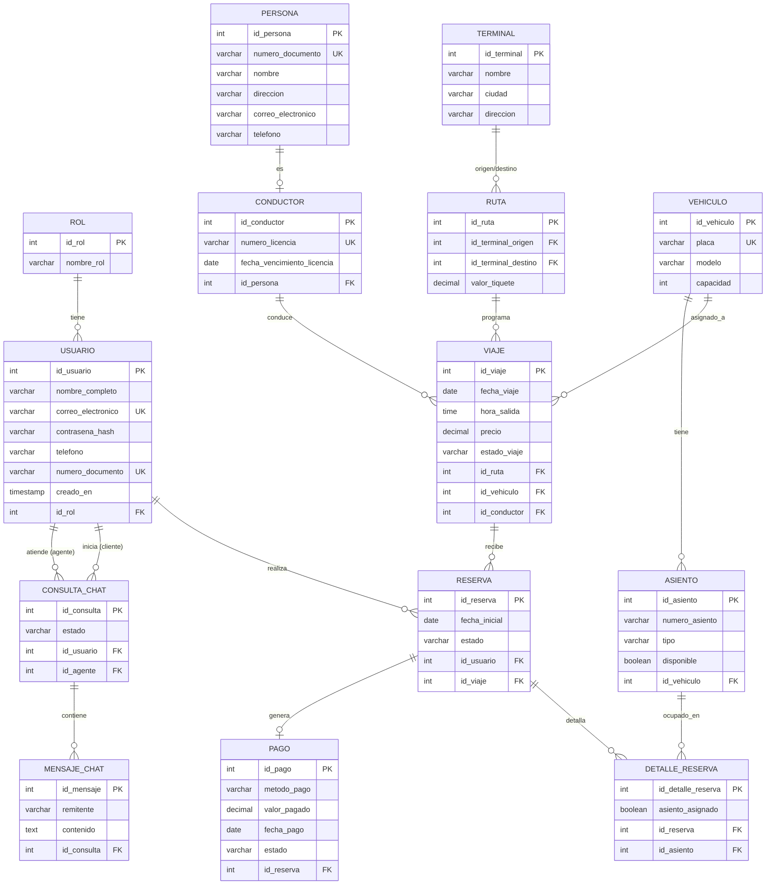

# 3. Base de Datos — Proyecto Concorde

> **Fuente oficial:** este documento se corrigió para coincidir
> exactamente con `docs/originales-equipo/Diccionario_de_Datos_Concorde_final.xlsx`
> (el diccionario de datos real del equipo) y con las entidades JPA del
> código. Ahí mismo están también los diagramas de clases, relacional
> y ERD originales del equipo (en PDF) — este `.md` es un complemento
> en texto/Mermaid para quien no pueda abrir los PDF fácilmente,
> **no un reemplazo**.

Motor: **PostgreSQL**. Scripts en la raíz del proyecto:
`crear_tablas_faltantes.sql` (catálogo, usuarios, reservas, pagos) y
`crear_tablas_chat.sql` (chatbot).

## 3.1 Diagrama entidad-relación

**Nota sobre PERSONA vs. USUARIO:** son dos tablas independientes a
propósito, no una heredando de la otra. `PERSONA` es la base de
`CONDUCTOR` (personal interno, sin acceso al sistema); `USUARIO` es
quien puede iniciar sesión (cliente, agente o administrador). Por eso
ambas tienen campos parecidos (nombre, documento, teléfono) sin que
esto sea una falla de normalización: modelan personas en dos contextos
distintos del negocio.

## 3.2 Normalización

- **1FN:** todos los campos son atómicos (no hay listas ni campos
  compuestos guardados como texto).
- **2FN:** todas las tablas tienen una llave primaria simple
  (`id_...`), así que no hay dependencias parciales posibles.
- **3FN:** los datos que dependen unos de otros están separados en su
  propia tabla en vez de repetirse. Ejemplos concretos:
  - La ciudad de una terminal vive en `TERMINAL`, no repetida en cada
    `RUTA` o `VIAJE` que la usa.
  - El precio de una ruta vive en `RUTA`, no repetido en cada `VIAJE`
    que la usa.
  - Los datos de un conductor viven en `PERSONA`/`CONDUCTOR`, no
    repetidos en cada `VIAJE` que conduce.

## 3.3 Integridad referencial

Todas las relaciones se implementan con llaves foráneas (`@ManyToOne` /
`@JoinColumn` en las entidades Java, `REFERENCES` en el SQL). Ejemplos
de reglas de integridad ya aplicadas:
- `mensaje_chat.id_consulta` tiene `ON DELETE CASCADE`: si se borra una
  conversación, sus mensajes se borran con ella (no quedan mensajes
  huérfanos).
- `usuario.correo_electronico` y `vehiculo.placa` son únicos (`UK`):
  no puede haber dos cuentas con el mismo correo ni dos buses con la
  misma placa.

### Corrección importante hecha en esta revisión

Al comparar `crear_tablas_faltantes.sql` contra el diccionario de
datos oficial y contra las entidades Java reales, se encontró que el
script tenía **dos tablas desactualizadas**, de una versión anterior
del proyecto:
- `usuario.rol` estaba como texto plano (`VARCHAR` con `CHECK`) en vez
  de una llave foránea a una tabla `ROL` — y esa tabla `ROL` nunca se
  creaba en el script.
- `conductor` tenía sus propios campos `nombre_completo`/`telefono` en
  vez de referenciar una tabla `PERSONA` aparte — y esa tabla `PERSONA`
  tampoco se creaba.

Esto significa que si alguien corría este script en una base nueva
desde cero, la aplicación **no habría podido arrancar** (el código
Java espera esas dos tablas). Ya se corrigió el script para que cree
`ROL` y `PERSONA` correctamente y coincida con el resto del proyecto.

## 3.4 Correspondencia con los requerimientos

| Requerimiento (ver `01-analisis-requerimientos.md`) | Tablas involucradas |
|---|---|
| RF01 — Búsqueda de viajes | `VIAJE`, `RUTA`, `TERMINAL` |
| RF04 — Reservar y pagar | `RESERVA`, `DETALLE_RESERVA`, `ASIENTO`, `PAGO` |
| RF07/RF08/RF09 — Chatbot y escalamiento | `CONSULTA_CHAT`, `MENSAJE_CHAT` |
| RF10 — Gestión de catálogo | `RUTA`, `TERMINAL`, `VEHICULO`, `CONDUCTOR`, `VIAJE` |
| RF11/RF12 — Reportes | `PAGO`, `RESERVA`, `VIAJE` (agregados, sin tablas nuevas) |
| RNF01 — Contraseñas hasheadas | `USUARIO.contrasena_hash` |
